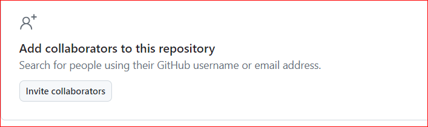

# Git Assignment - <MaggieOma>
a. What is an issue?

- It is tool or means for reporting and tracking bugs and troubleshooting tasks or resquests in repos. Issues can be created, have statuses and can be opened/closed, prioritized/triaged and organised for integration and resolution.

b. What is a pull request?
 - A pull request is a funtional feature within Github used for versions control and to notify users of changes made or completed. Comment and remark can be added to a branch before a pull in merged to the main branch/repo. It is a collaborative tool fore development, review,

 
c. How do I open up a pull request?
 - A pull can be done by first forking a repository on GitHub. A copy of the repository is then created within the fork-creator's account with their user name. A new branch can be created on github or locally, all changes can be made, staged, committed and pushed to Gitbub; which would lead to a compare and pull request prompt. Option to compare from main/master to branch name can be selected accordingly ( a title/description of changes made is best practice - within the text box provide in view). Pull request can be clicked on once these steps are completed.

d. Give me a step by step guide on how to add someone to your repository.

step 1:  You get on your onw github account and the repository of collaborator interest. 
step 2:  "Add the collaborator" via the tab on the right side of the screen.

step 3:  add the username or email address of the collaborator and acess levels. The user should recieve the invitation to join the repository.

e. What is the difference between git and GitHub?
 - Github is the centralized service platform that offers collaboration feature for project management and development needs. Github improves Gits capabilities and enhances the functunality of version control. whereas, Git is command line tool for source codes.

f. What does git diff do?
- It shows differencet between various commits,branches and directories; both locally and remotely.

g. What is the main branch?
- The main branch is the default/primary branch in a repository, which hosts the main version. Only approved revised chnages should be made to the main branch. It is the base branch.

h. Besides our initial commit if it is a new repository, should we directly push our changes directly into the main branch?
- No,in real world projects, changes should first be reviewed, before being pushed or pulled to the stable main/master branch. 

